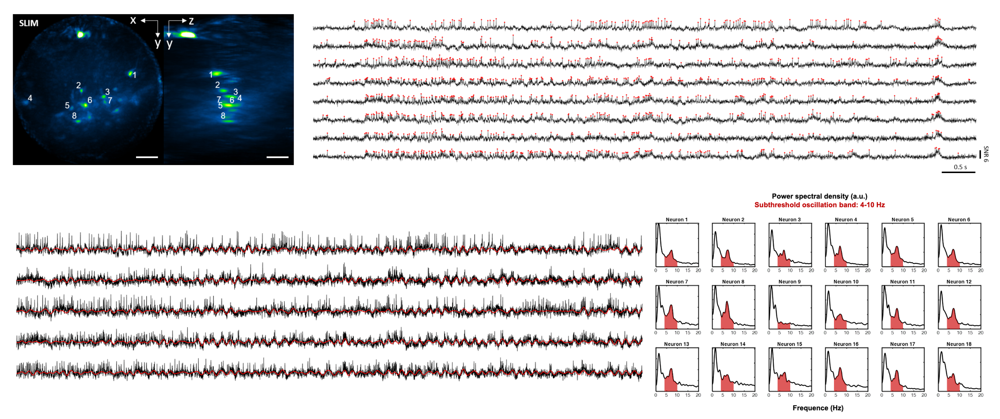

# Kilohertz volumetric imaging of in-vivo dynamics using squeezed light field microscopy

<h4 align="center">3D Reconstruction code for Squeezed Light field Microscopy (SLIM) using Richardson-Lucy Deconvolution</h4>

## Abstract
SLIM addresses the sensor framerate bottleneck in light field microscopy by taking advantage of information redundancy in light field raw measurements. Using a series of optical image rotation and scaling, SLIM squeezes the raw measurement into a letterbox-like small region of interest on camera sensor. And a reconstruction algorithm reconstructs the squeezed measurement back into a 3D image stack in post-processing. Due to fewer number of pixels being readout, higher imaging speed could be achieved during acquisition. SLIM demonstrated __kilohertz 3D imaging__ in blood flow of embryonic zebrafish, neuronal voltage signals of leech ganglion, and of hippocampus of behaving mice. 

<h6 align="center">Voltage imaging in mouse brain</h6> 

## Quick demo (🚀 in 5 minute)

### Environment
Tested on Matlab `2022a`, `2023a`, `2024a`. GPU acceleration with Parallel Computing Toolbox is highly recommended. 

 

### Steps
0. Download the code [repository](https://github.com/aaronzq/SLIM/tree/master). 
1. Run the GUI software __SLF_ReconGUI.m__ in Matlab.
 

2. Click the button __Load configs__ to load preset parameters for example data. These presets are json files in folders under `/examples`. The name of folders labels the sample type. For example, choose `/examples/config_beads.json` to reconstruct beads data.
3. Click the button __Reconstruct__ to start reconstruction. The progress will be printed in command window. The results are saved in a new folder named `/Recon_RL` under the same directory of raw data.

## Code

 `RL_SLF_Recon.m` Script version of reconstruction algorithm

 `SLF_ReconGUI.m` GUI version of reconstruction algorithm

### Parameters (GUI)

 - `Squeezing ratio`: The vertical image scaling ratio.
 - `Resolution(horizontal)`: The horizontal pixel resolution of each view. The vertical resolution is going to be the multiplication of this and squeezing ratio
 - `PSF background`: The background to be subtracted during reading PSFs. 
 - `Load existing PSF?`: Whether to directly read processed PSFs from a .mat file. The file will be automatically searched under `PSF directory` and specified by the depth range (i.e. `Z1`, `Z2`, `dZ`), e.g. `./examples/beads/PSF_320/PSF_resolution_305_61_z_101_subaperture_29.mat`. Such .mat file will be generated when processing PSFs, when `Load existing PSF?` is not enabled.
 - `Image background`: The background to be subtracted during reading raw image.
 - `Iteration Num`: Deconvolution iteration steps
 - `Intensity Scale`: A gain applied to final results, before converting to uint16.
 - `Conv. Algorithm`: Different options for convolution implementation.
 - `Using GPU`: Whether to use GPU acceleration with Parallel Computing Toolbox.
 - `Angles`: In-plane rotation applied to each sub-aperture view. Counter-clock wise.
 - `Center(x), Center(y)`: The centroid location of each sub-aperture view.

### Usage (GUI)

Configurate proper parameters and click __Reconstruct__ to run reconstruction algorithm. 

The `Squeezing ratio`, `Resolution(horizontal)`, `Angles` and `Center(x), Center(y)` of views should be characterized on specific hardware setups. The information of our setups is given in the attached json files and also in the manuscript. 

Note that:

1. The reading of PSF and raw image data currently defines a depth/time list by `Z1:dZ:Z2`/`T1:T2` first, and synthesizes a list of file names accoding to the naming convention such as `ss_single_%d.tiff`. Eventually when reading files what the algorithm looks at is only the file name list.
2. The `Num` box below the title __Sub-aperture views__ controls the number of rows in the interactive table below. 
3. `Angles`, `Center(x)` and `Center(y)` can be manually edited in the interactive table. We also provide a semi-automatic program to calibrate the centroid positions using _a PSF image on native focal plane_. We have provided an example PSF in `./examples/beads/PSF_320/0.tiff.tif`. After typing in correct `Num` and `Angles` of sub-aperture views, click on button __Calibrate positions__. Choose this example PSF and follow the instructions given in the command window. After it finishes, the positions in the interactive table will be updated. And a calibration file named `Calibraiton.mat` will be saved under the same directory of the PSF file. Later, the button __Load positions__ can be used to load positions from such calibration file.
4. The plot in the GUI is only for visualizing positions of each sub-aperture views(red rectangles). It's not used in reconstruction.

## Testing dataset

- /examples/beads: fluorescent beads 
- /examples/leech: leech ganglion 
- /examples/mouse: mouse hippocampus neurons 

## Paper

Please cite our work if you find it helpful.

[Wang, Zhaoqiang, et al. "Kilohertz volumetric imaging of in-vivo dynamics using squeezed light field microscopy." bioRxiv (2024)](https://www.biorxiv.org/content/10.1101/2024.03.23.586416v2.full)

